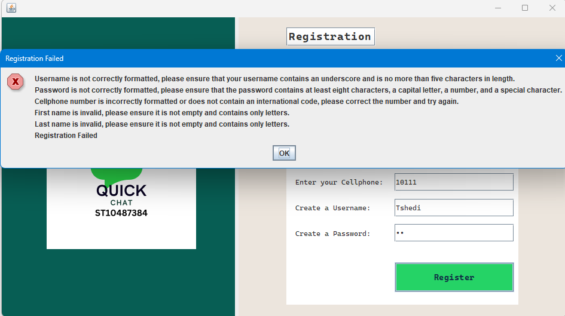

# QuickChat - PROG5121 POE Part 1

**Author**: Tshedimosetso Wowana - ST10487384@rcconnect.edu.za

QuickChat is a simple chat application developed for PROG5121 POE Part 1. Version 1.0.0 implements user registration and login functionality, with messaging planned for Part 2. Built using Java, Apache NetBeans 19, JDK 21, Maven, and JUnit5 for testing.

## Features

### Registration
- **Functionality**: Register with a username, password, cellphone number, first name, and last name.
- **Validation**:
  - Username: Max 5 characters, requires an underscore (e.g., `Tshe_`).
  - Password: 8+ characters, must include a capital letter, number, and special character (e.g., `Password123!`).
  - Cellphone: Starts with `+27` followed by 9 digits (e.g., `+27727861959`).
  - First/Last Name: Letters only, non-empty (e.g., `Tshedimosetso`, `Wowana`).
- **Feedback**: Returns 6 messages (5 field-specific success/error + 1 final status: "Registration successful" or "Registration aborted").
- **Implementation**: `Registration.java` validates via setters; `RegistrationForm.java` manages the GUI.

### Login
- **Functionality**: Log in with registered username and password.
- **Validation**: Matches credentials against stored registration data.
- **Feedback**: Success shows a "Messaging feature coming soon" placeholder; failure displays an error.
- **Implementation**: `Login.java` handles verification; `LoginForm.java` manages the GUI.

### Planned for Part 2
- **Messaging**: Not included in Part 1; placeholder indicates future implementation.

## Screenshots

### Registration Form
  
Appears on startup, prompting the user for all credentials.

### Registration Feedback (Errors)
  
Displays all error messages (e.g., "Username is not correctly formatted...") with "Registration Failed" for fully invalid input.

### Registration Success
  
Shows all 6 success messages (e.g., "Username successfully captured" to "Registration successful") before switching to LoginForm.

### Login Form
  
Appears after successful registration, prompting username and password entry.

### Login Feedback (Errors)
  
Displays an error message if credentials do not match instance fields.

### Login Success
  
Appears after successful login, exiting the app.

## Setup and Running

### Prerequisites
- Java JDK 21+
- Apache NetBeans 19
- Maven (with JUnit5)
- GitHub GUI/CLI

### Installation
1. Clone the repo: `https://github.com/RC-IMAD-POE-2025/rc-pta-prog5121-bib-gr04-poe-ST10487384`
2. Switch to branch: `git checkout main`
3. Open in NetBeans.
4. Build and run: `mvn clean install` then `mvn exec:java`.

### Testing
- Location: `RegistrationTest.java` in `testpackages` (24 tests).
- Run: `mvn test` or use NetBeans test runner.

## Project Structure
- **Core**: `Registration.java`, `Login.java`
- **GUI**: `QuickChat.java`, `RegistrationForm.java`, `LoginForm.java`
- **Tests**: `RegistrationTest.java`
- **Screenshots**: `screenshots/` directory

## Version
- **v1.0.0**: Initial release for POE Part 1, submitted April 11, 2025.